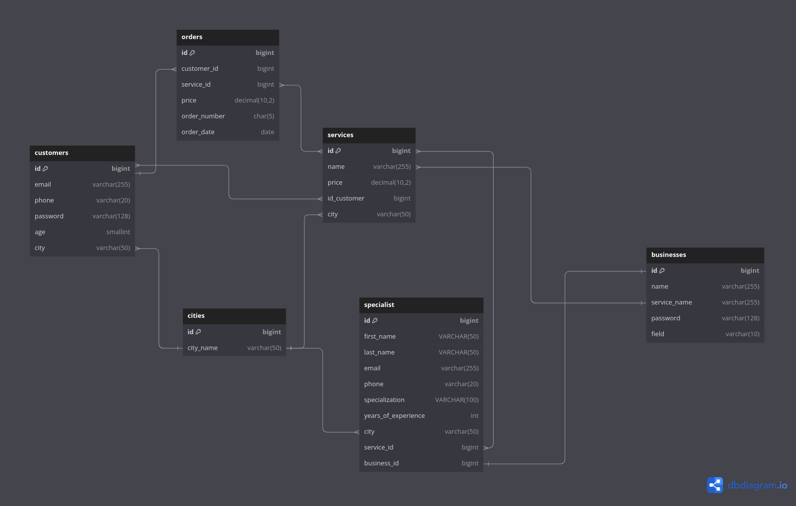

# Beauty Agency
### Database Schema

This is the database schema for the project:


### Files description

1) create_tables_script.sql - script for tables creation.
2) create_view.sql - script for view creation.
3) create_user.sql - script for adding user and for granting some privileges.
4) main.py - python script that inserts some data into tables.

### Requirements

- Python 3.9.6
- MySQL Server
- `mysql-connector-python` package
- `python-dotenv` package

### How to run main.py
- Run script.sql in your database.
- Set environment variables (host, user, password, database).
- Run: 
- ```sh 
  pip install -r requirements.txt
- Run main.py.


# Practical assignment 3

## The purpose of this task

Learn how to develop DB for particular application.

You can work alone or in pairs with a colleague (maximum 2 people in a team). In the case when you are working on the task together, then you should also present in pairs.

## Requirements

### Basic requirements (_for 22 points_):

1) Build your own operational database for your business.
2) Use relationships: 1:1, 1:many, many:many.
3) Use constraints.
4) Use indexes for optimization (_that is why you need to insert approximately 500 000 rows in some tables to be able to show performance optimization_).
5) Do not forget add comments on tables and on tables' columns.
6) Be able to present ERD.
7) Be able to explain your solution using the correct terminology.


### Additional points (_for 2 points_):
- Create at least 3 different users for different purposes **_+0.5_**

- Create at least 1 view **_+0.5_**

- Create stored procedure **_+0.5_**

- Create trigger or function **_+0.5_**

Meeting the basic requirements of Practical Assignment 3 allows for a maximum of 22 points to be earned, and completing additional tasks listed under the heading "Additional points" can yield up to 2 extra points.
